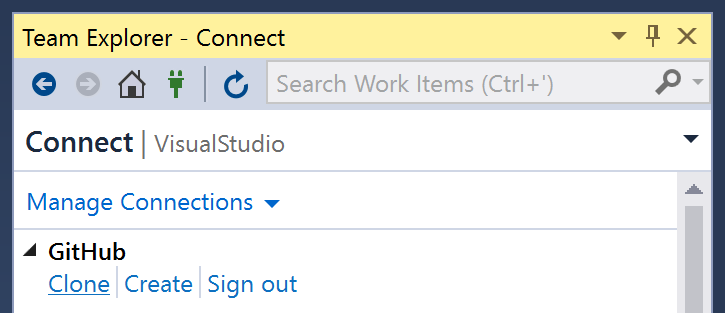
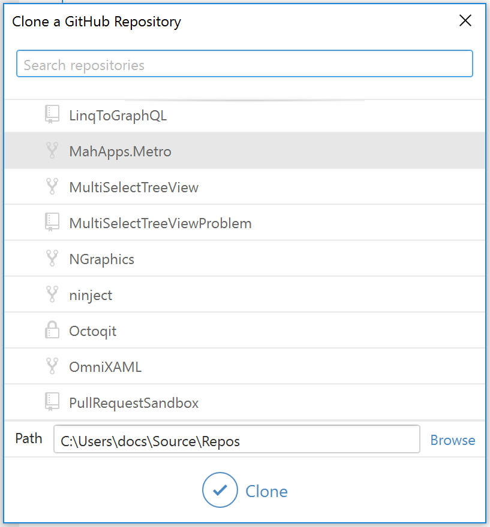

# Cloning a repository to Visual Studio

After you provide your GitHub or GitHub Enterprise credentials to GitHub for Visual Studio, the extension automatically detects the personal and organization repositories you have access to on your account.

1. Open **Team Explorer** by clicking on its tab next to *Solution Explorer*, or via the *View* menu.
2. Click the **Manage Connections** toolbar button.

3. Next to the account you want to clone from, click **Clone**.

4. In the list of repositories, click the repository you'd like to clone.

5. If desired, change the local path where the repository will be cloned into, or leave the default as-is. Click **Clone**.
6. In Team Explorer, under the list of repositories, locate the repository and double-click to open the project in Visual Studio.
