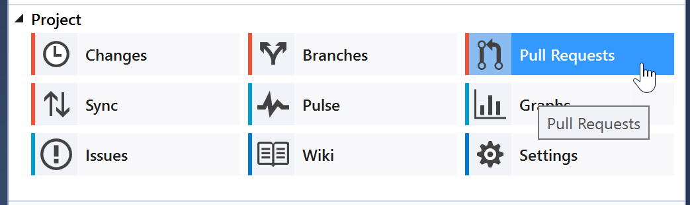

# Creating a pull request

1. Open a solution in a GitHub repository.
2. Open **Team Explorer** and click the **Pull Requests** button to open the **GitHub** pane.

3. Click the **Create New** link above the list of pull requests for the repository.
4. Select the target branch by clicking the link. If the current repository is a fork, then there will be two sets of branches in the dropdown - to submit a pull request upstream then select a branch with the `owner:` prefix of the upstream repository.

5. Enter a pull request title and an optional description.
6. Click the **Create Pull Request** button.
