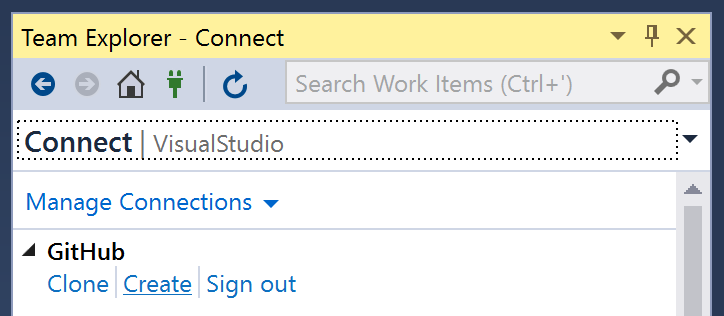
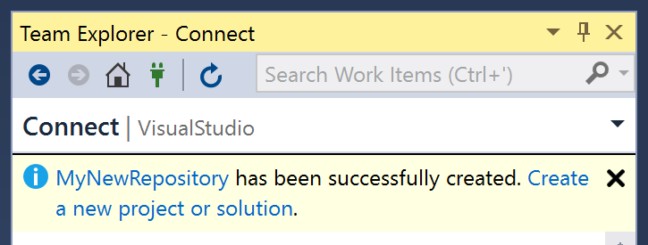

# Creating an empty repository from Visual Studio

1. [Sign in](authenticating-to-github) to GitHub.

2. Open **Team Explorer** by clicking on its tab next to *Solution Explorer*, or via the *View* menu.

3. Click the **Manage Connections** toolbar button.

   

4. Click the **Create** link next to the account you want to create the repository in.

   

5. In the **Create a GitHub Repository** dialog, enter a name, description and local path for the repository.

    

6. Select a license for the repository.

7. Check the **Private Repository** box if you want to upload the repository as a private repository on GitHub. You must have a [Developer, Team or Business account](https://github.com/pricing) to create private repositories.

8. Click the **Create** button to create the repository

9. When the repository is created, click the **Create a new Project or Solution** link in Team Explorer to create a project or solution in the repository.

    
