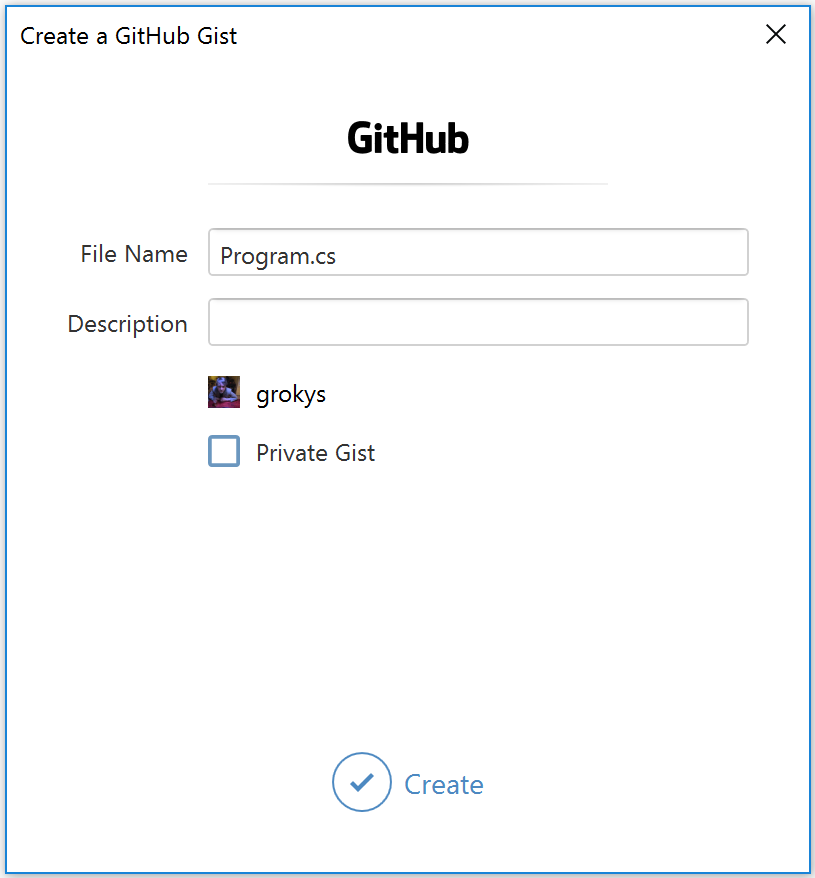

# Creating Gists

> You must be [logged in to GitHub](../getting-started/authenticating-to-github.md) to create a Gist

GitHub for Visual Studio enables easy creation of gists directly from the Visual Studio Editor.

1. Open a file in the Visual Studio text editor.

2. Select the section of text that you want to create a gist from.

3. Right click and select **Create a GitHub Gist** from the **GitHub** submenu.

   

4. In the **Create a GitHub Gist** dialog, check that the filename is correct and optionally add a description.

   

5. If you want the gist to be private, check the **Private Gist** checkbox.

6. Click **Create**.

7. Once the gist is created it will be opened in your browser.

