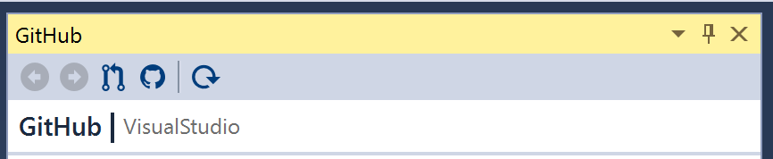

# Using the GitHub pane toolbar

The GitHub pane toolbar provides a way to navigate between views, refresh views, and open the current view on GitHub.

1. Open a solution in a GitHub repository.
2. Open **Team Explorer** and click the **Pull Requests** button to open the **GitHub** pane.

## Using the back navigation button
1. At the top of the **GitHub** pane, locate the button furthest to the left. This is the **Back** button.
2. Click **Back** to navigate to the previous view. If **Back** is grey, you have reached the initial point in the view navigation.

## Using the forward navigation button
1. At the top of the **GitHub** pane, locate the second button from the left, which is the **Forward** button.
2. Click **Forward** to navigate to the next view. If **Forward** is grey, you have reached the furthest point in the view navigation.

## Using the pull request toolbar icon
1. At the top of the **GitHub** pane, locate the third button from the left. This is the **Pull Requests** button.
2. Click **Pull Requests** to navigate to the list of pull requests in the repository.

## Using the GitHub toolbar button
1. At the top of the **GitHub** pane, locate the fourth button from the left. This is the **View On GitHub** button.
2. While viewing the list of pull requests, click **View On Github**. Your browser will open and navigate to the repository's pull requests on GitHub.
3. While viewing the details of a pull request, click **View On Github**. Your browser will open and navigate to the pull request on GitHub.

## Using the refresh toolbar button
1. At the top of the **GitHub** pane, locate the fifth button from the left. This is the **Refresh** button.
2. Click **Refresh** to refresh the current view in the **GitHub** pane.
