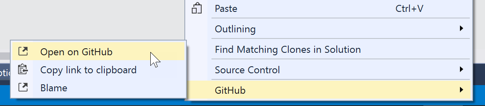

# Viewing existing code on GitHub

GitHub for Visual Studio enables easy navigation to code that exists on GitHub directly from the Visual Studio code editor.

1. Open a solution in a GitHub repository.
2. Open *Solution Explorer* by clicking on its tab, or via the *View* menu.
3. In *Solution Explorer*, double click on a file to open it in Visual Studio code editor.
3. In the code editor, highlight the section of text that you want to view in the browser.

## Viewing the selected code on GitHub
1. Right click and select **Open on GitHub** from the **GitHub** submenu.

2. Your browser will open and navigate to the code on GitHub.

## Copying the URL of the selected code's location on GitHub
1. Right click and select **Copy link to clipboard** from the **GitHub** submenu. The URL will be copied to the clipboard.
2. Paste the URL into your browser to view it on GitHub.

## Viewing the selected code in blame view on GitHub
1. Right click and select **Blame** from the **GitHub** submenu.
2. Your browser will open and navigate to the code in blame view on GitHub.
