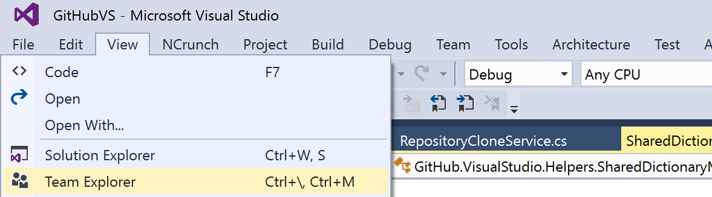
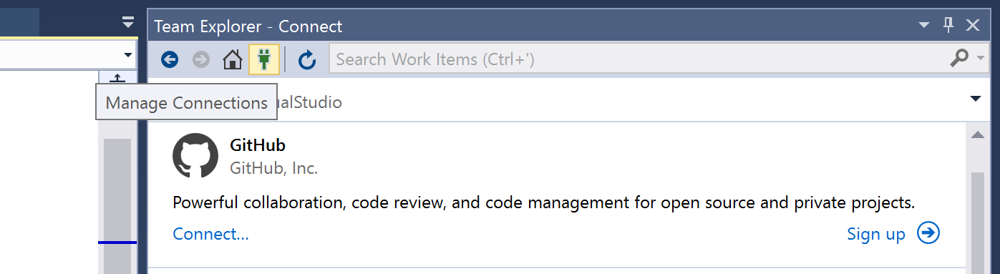
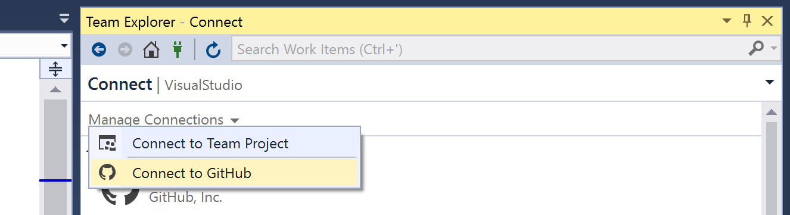
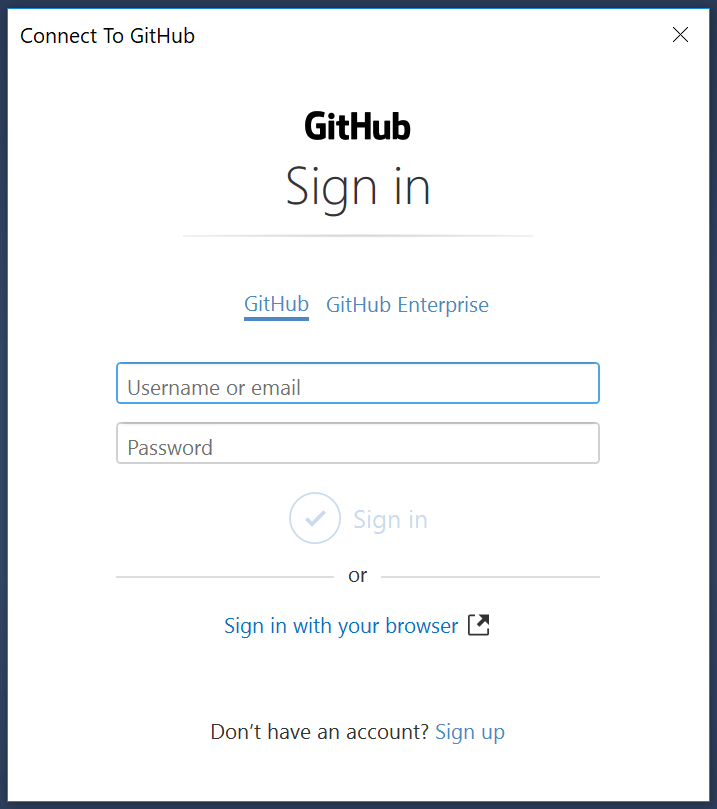
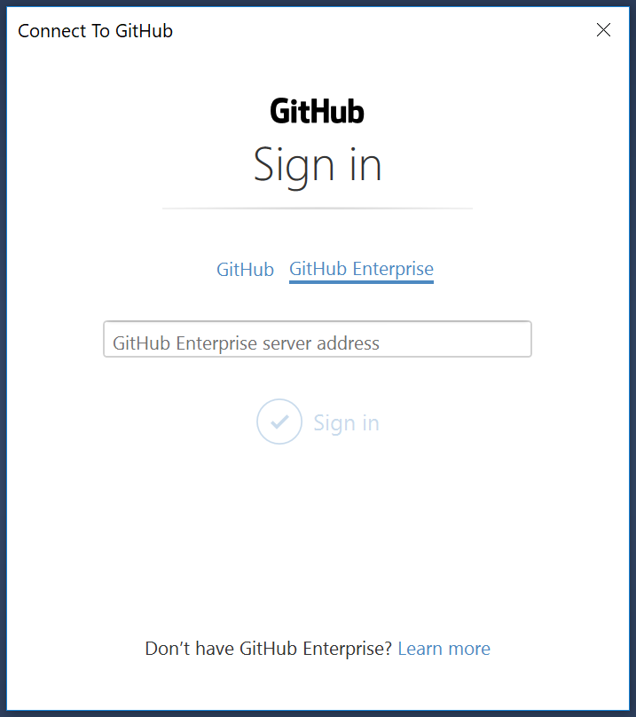

# Authenticating to GitHub

Add your GitHub.com or GitHub Enterprise account information to GitHub Desktop so you can access your repositories.

Before you authenticate, you must already have a GitHub or GitHub Enterprise account.

- For more information on creating a GitHub account, see "[Signing up for a new GitHub account](https://help.github.com/articles/signing-up-for-a-new-github-account/)".
- For a GitHub Enterprise account, contact your GitHub Enterprise site administrator.

**Note:** If your organization is on the [Business plan](https://help.github.com/articles/organization-billing-plans) and has not enabled SAML single sign-on or login with username and passowrd, you must create and authorize a personal access token to access protected content. In addition, SAML single sign-on is not available for GitHub enterprise versions less than 2.12.2.

**Important**: The required scopes for the personal access token are: `user`, `repo`, `gist`, and `write:public_key`. 
- *user* scope: Grants access to the user profile data. We currently use this to display your avatar and check whether your plans lets you publish private repositories.
- *repo* scope: Grants read/write access to code, commit statuses, invitations, collaborators, adding team memberships, and deployment statuses for public and private repositories and organizations. This is needed for all git network operations (push, pull, fetch), and for getting information about the repository you're currently working on.
- *gist* scope: Grants write access to gists. We use this in our gist feature, so you can highlight code and create gists directly from Visual Studio
- *write:public_key* scope: Grants access to creating, listing, and viewing details for public keys. This will allows us to add ssh support to your repositories, if you are unable to go through https (this feature is not available yet)

For more information on creating personal access tokens, see "[Creating a personal access token for the command line](https://help.github.com/articles/creating-a-personal-access-token-for-the-command-line). 

For more information on authenticating with SAML single sign-on, see "[About authentication with SAML single sign-on](https://help.github.com/articles/about-authentication-with-saml-single-sign-on)."

1. In Visual Studio, select **Team Explorer** from the **View** menu.

2. In the Team Explorer pane, click the **Manage Connections** toolbar button.

3. Click the **Connect** link in the GitHub section. If you are already connected to a GitHub instance and want to connect to another, this link will not be visible; instead click **Manage Connections** and then **Connect to GitHub**.

4. In the **Connect to GitHub dialog** choose **GitHub** or **GitHub Enterprise**, depending on which product you're using.

**GitHub option**:  

- To sign in with credentials, enter either username or email and password.
- To sign in with SSO, select `Sign in with your browser`.

**GitHub Enterprise option**:  

- To sign in with credentials, first enter GitHub Enterprise server address. Once a valid server address is entered, a `Token` field appears and a valid token can be entered to sign in.
  - To sign in with SSO, first enter the GitHub Enterprise server address. Once a valid server address is entered, select `Sign in with your browser`. Follow the steps to authenticate with your SSO provider.
