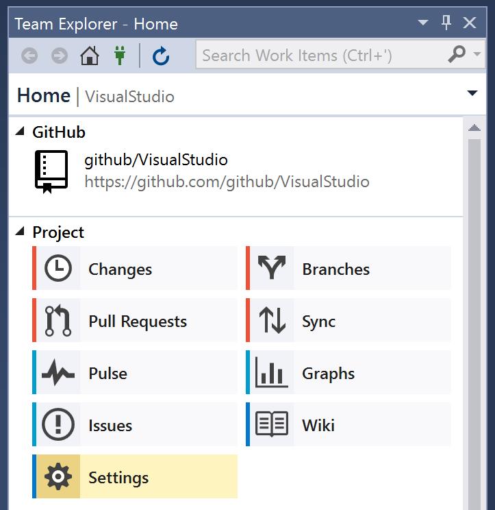
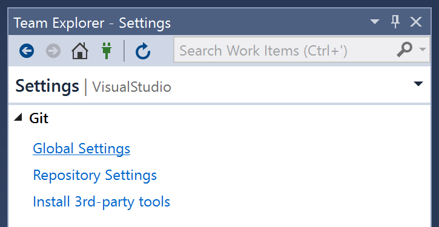

# Configuring Git in Visual Studio

# Setting your name and email

The name and email that will be displayed with your commits can be set from Team Explorer's settings.

1. Open **Team Explorer** by clicking on its tab next to *Solution Explorer*, or via the *View* menu.

2. Click the **Settings** button in Team Explorer.

   

3. Click **Global Settings** in the Team Explorer Settings page

   

4. Enter the name and email that you would like to appear in commits.