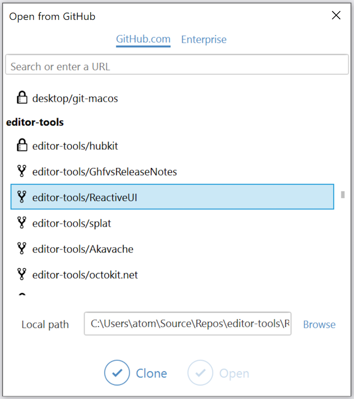
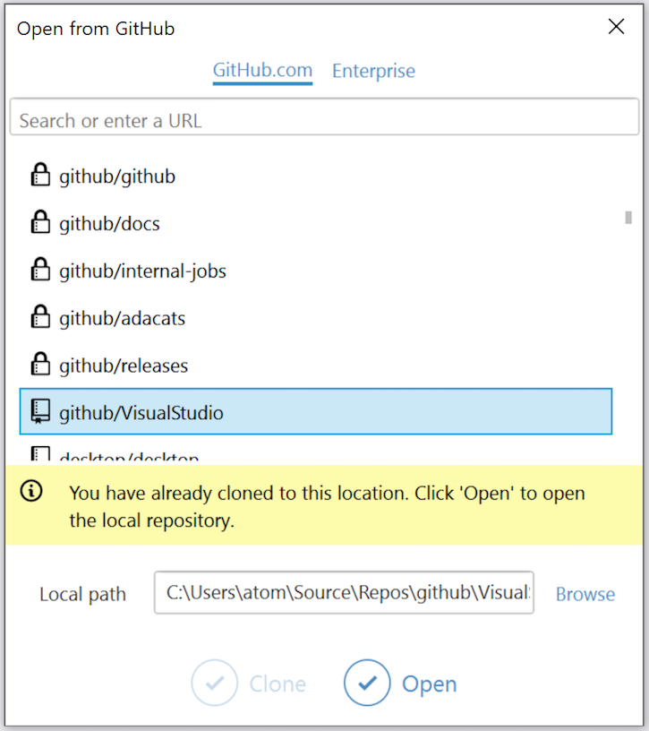

# Cloning a repository to Visual Studio

After you provide your GitHub or GitHub Enterprise credentials to GitHub for Visual Studio, the extension automatically detects the personal, collaborator and organization repositories you have access to on your account.

## Opening the clone dialog

### From **Team Explorer**

Open **Team Explorer** by clicking on its tab next to *Solution Explorer*, or via the *View* menu.
Click the **Manage Connections** toolbar button.

Next to the account you want to clone from, click **Clone**.

### From the **Start Page**

Using Visual Studio 2017, click the `GitHub` button on the `Start Page` to open the clone dialog.

### From the **Start Window**

Using Visual Studio 2019, on the `Start Window` select `Clone or check out code` and then click the `GitHub` button to open the clone dialog.

### From the **File** menu

Go to `File > Open > Open From GitHub...`

## Clone repositories
1. In the list of repositories, scroll until you find the repository you'd like to clone.

You can also filter the repository results by using the *Filter* text box.

In addition to using the list of personal, collaborator and organization repositories, you can enter a repository URL to clone a public repository.

2. If desired, change the local path that the repository will be cloned into, or leave the default as-is.
3. Once a repository is selected and the path is set, Click **Clone**.
4. In Team Explorer, under the list of solutions, double-click on a solution to open it in Visual Studio.

## Open repositories
For any repository that you select from the list or provide a URL for that you already have cloned locally, the **Open** button becomes enabled and a message shows that you have already cloned the repository to that location.

