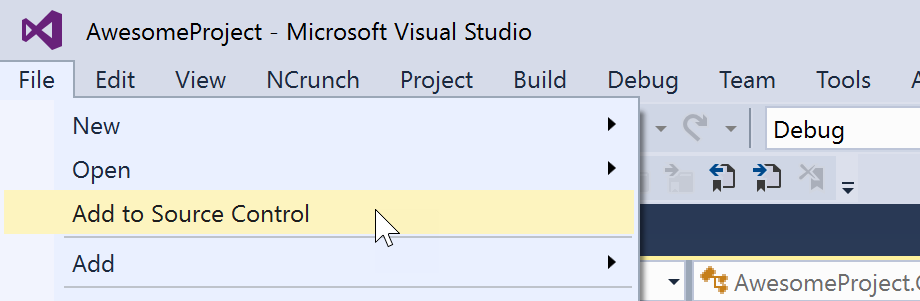

# Publishing an existing project to GitHub

1. Open a solution in Visual Studio.
2. If solution is not already initialized as a Git repository, select **Add to Source Control** from the **File** menu.

3. Open **Team Explorer**.

4. In Team Explorer, click **Sync**.

5. Click the **Publish to GitHub** button.

6. Enter a name and description for the repository on GitHub.
7. Check the **Private Repository** box if you want to upload the repository as a private repository on GitHub. You must have a [Developer, Team or Business account](https://github.com/pricing) to create private repositories.
8. Click the **Publish** button.
