# Reviewing a pull request in Visual Studio

GitHub for Visual Studio provides facilities for reviewing a pull request directly in Visual Studio.

1. Open a solution in a GitHub repository.

2. Open **Team Explorer** and click the **Pull Requests** button to open the **GitHub** pane.

   

3. Click the title of the pull request to be reviewed.

## Viewing a pull request

The Pull Request Details view shows the current state of the pull request, including:
- information about who created the pull request
- the source and target branch
- a description of the pull request
- reviewers and the status of their review
- checks (if checks have been enabled for the repository)
- the files changed

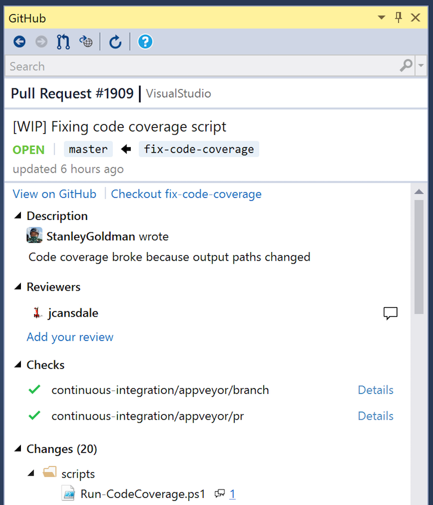

## Checking out a pull request

To check out the pull request branch, click the **Checkout [branch]** link where [branch] is the name of the branch that will be checked out.

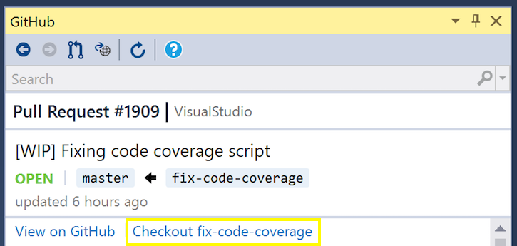

If the pull request is from a fork then a remote will be added to the forked repository and the branch checked out locally. This remote will automatically be cleaned up when the local branch is deleted.

> Note that you cannot check out a pull request branch when your working directory has uncommitted changes. First commit or stash your changes and then refresh the Pull Request view.

## Viewing Changes

To view the changes in the pull request for a file, double click a file in the **Changed Files** tree. This will open the Visual Studio diff viewer.

You can also right-click on a file in the changed files tree to get more options:

- **View Changes**: This is the default option that is also triggered when the file is double-clicked. It shows the changes to the file that are introduced by the pull request.
- **View File**: This opens a read-only editor showing the contents of the file in the pull request.
- **View Changes in Solution**: This menu item is only available when the pull request branch is checked out. It shows the changes in the pull request, but the right hand side of the diff is the file in the working directory. This view allows you to use Visual Studio navigation commands such as **Go to Definition (F12)**.
- **Open File in Solution**: This menu item opens the working directory file in an editor.

## Leaving Comments

You can add comments to a pull request directly from Visual Studio. When a file is [open in the diff viewer](#viewing-changes) you can click the **Add Comment** icon in the margin to add a comment on a line.

Then click the icon on the desired line and leave a comment.
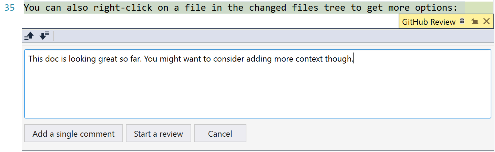

To just comment on this one line, select **Add a single comment**. This will add the comment immediately.

To start a review of the Pull Request and all its changes, select **Start a review**. This will add this comment as pending, and the comment will be submitted once the review is complete.

#### Viewing comments

Existing comments left by you or other reviewers will also show up in this margin. Click the icon to open an inline conversation view from which you can review and reply to comments.

Single comments appear like this when viewed inline.
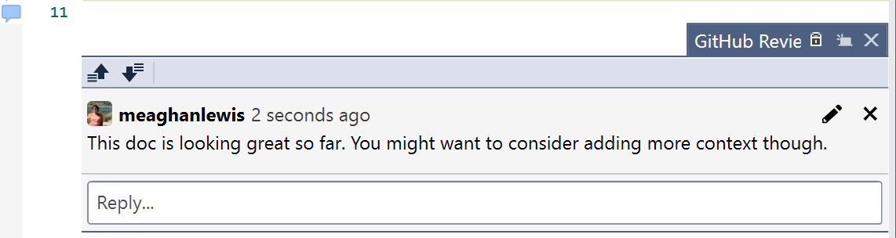

Review comments appear the same as single comments except for a Pending badge is added to the comment.
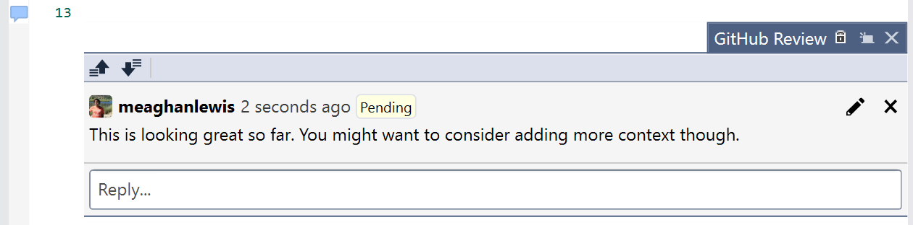

#### Modifying Comments

Single and review comments can either be edited or deleted.

To edit a comment, press the pencil symbol to edit the comment and then select **Update comment** once finished.
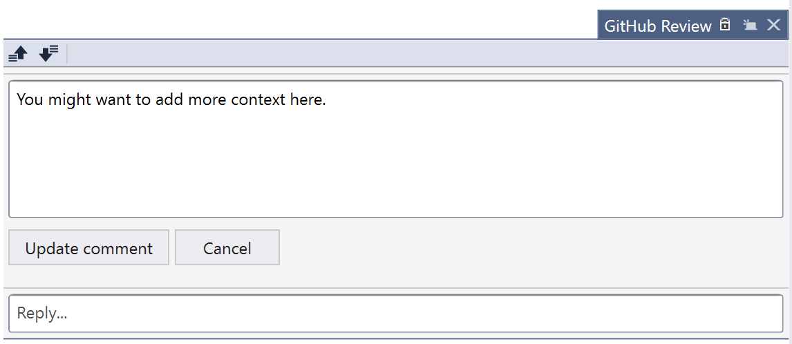

To delete a comment, press the x symbol. A confirmation box to delete the comment will appear.
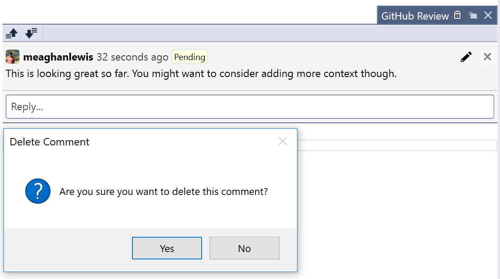

#### Submitting a review

From the pull request details view you can go to the review summary and submit a review.

If you have pending review comments you'll see the option **Continue your review**:
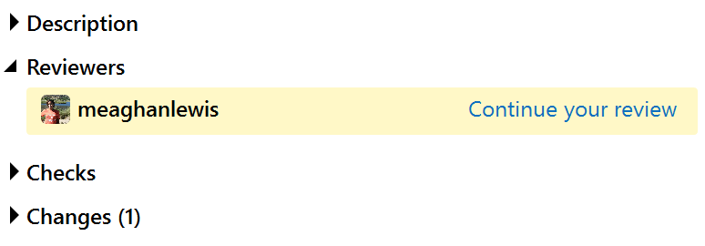

Otherwise you'll see an option to **Add your review**:
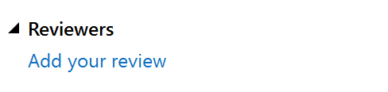

When you are redirected to the review summary view, leave a review summary and select **Submit review**.
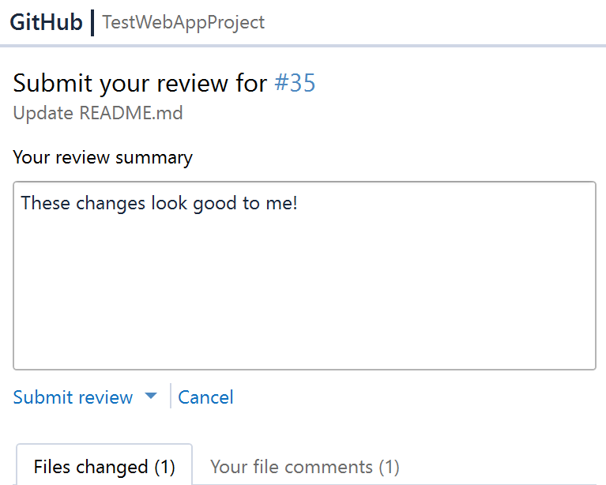

The options available are to **Approve**, **Comment only** or **Request changes**.
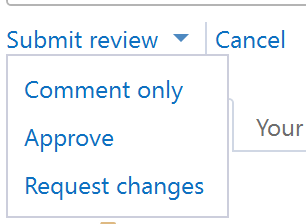
