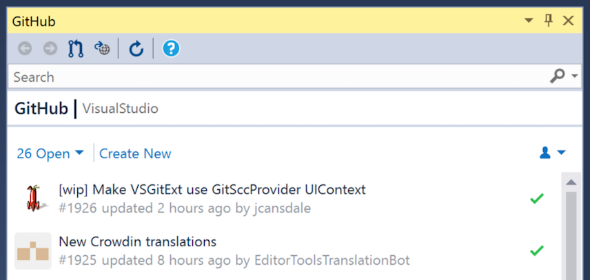
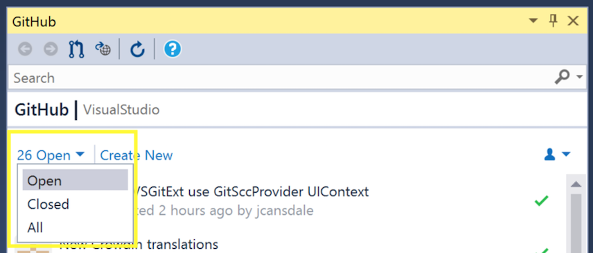
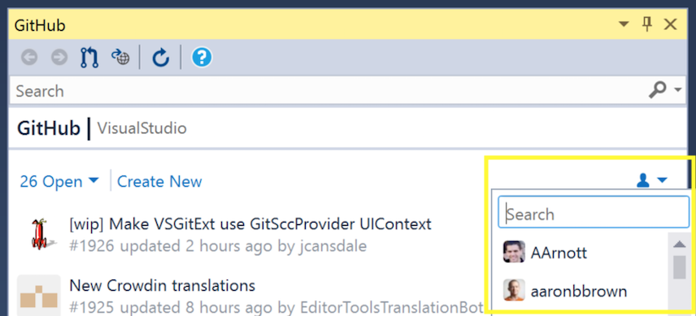

# Viewing the pull requests for a repository

GitHub for Visual Studio exposes the pull requests for the current repository and lets you create new pull requests and review pull requests from other contributors.

1. [Sign in](../getting-started/authenticating-to-github.md) to GitHub.
2. Open a solution in a GitHub repository.
3. Open **Team Explorer** and click the **Pull Requests** button to open the **GitHub** pane.

4. The open pull requests will be displayed.

5. Change the pull requests listed by clicking the **Open** link and selecting the filter you want to use from the dropdown with the options *Open/Closed/All*.

6. Filter pull requests by author by clicking the person icon and selecting the user you want to view from the dropdown. You can also search for users from the dropdown.

7. Double-click anywhere in the pull request item to [view the pull request details and review the pull request](reviewing-a-pull-request-in-visual-studio.md)
8. Click on the **Create New** link to [create a pull request from the current branch](creating-a-pull-request.md)
